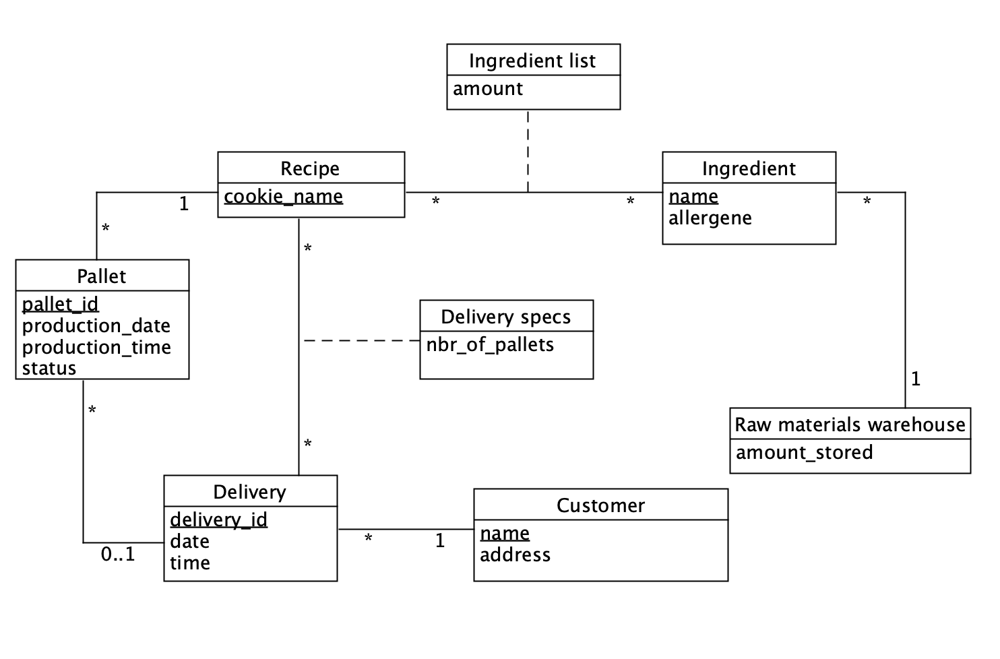

# EDAF75, project report

This is the report for

 + Arvid Gramer, ar8384gr-s
 + Nils Romanus Myrberg, ni5324ro-s

We solved this project on our own, except for:

 + The Peer-review meeting

## ER-design

The model is in the file [`er-model-2.1.png`](er-model-2.1.png):

<center>
    
</center>


## Tables

The ER-model above gives the following tables (including keys and
foreign keys):

```text
table raw_materials_warehouse:
  ingredient_name
  amount_stored
  last_delivery
  PK: ingredient_name
  FK: ingredient_name -> ingredients(ingredient_name)

table ingredients:
  ingredient_name
  unit  
  PK: ingredient_name

table ingredient_list:
  cookie_name
  ingredient_name
  amount
  
  PK: cookie_name, ingredient_name
  FK: cookie_name -> recipes(cookie_name)
  FK: ingredient_name -> ingredient(ingredient_name)

table recipes:
  cookie_name
  PK: cookie_name

table pallets:
  pallet_id
  cookie_name
  production_date
  status
  delivery_id
  PK: pallet_id
  FK: cookie_name -> recipes(cookie_name)
  FK: delivery_id -> deliveries(delivery_id)
  
table deliveries:
  delivery_id
  delivery_date
  delivery_time
  customer_name
  PK: delivery_id
  FK: customer_name -> customer(customer_name)

table delivery_specs:
  cookie_name
  delivery_id
  nbr_of_pallets
  PK: (cookie_name, delivery_id)
  FK cookie_name -> recipes(cookie_name)
  FK delivery_id -> deliveries(delivery_id)

table customers:
  customer_name
  customer_address

  PK: customer_name
```

## Script to set up database

The script used to set up  the database is in:

 + [`create_krusty_schema.sql`](create_krusty_schema.sql) (defines the tables)

So, to create and initialize the database, we run:

```shell
sqlite3 krusty_db.sqlite < create_krusty_schema.sql
```

## How to compile and run the program

This section should give a few simple commands to type to
compile and run the program from the command line, such as:

```shell
python krusty_app.py
```
